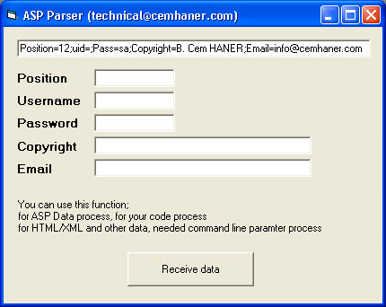



## ASP Style String Splitter\(Parser\)

### Description

You know ASP and HTML String container. For example www.planet-source-code.com?X=1;R=10. How can I X content from this string ? What's X ? This program is this! Thanx for your vote.
 
### More Info
 

             |
---                |---
**Submitted On**   |2003-12-30 16:08:00
**By**             |[B\.Cem HANER](https://github.com/Planet-Source-Code/PSCIndex/blob/master/ByAuthor/b-cem-haner.md)
**Level**          |Intermediate
**User Rating**    |5.0 (15 globes from 3 users)
**Compatibility**  |VB 5\.0, VB 6\.0, ASP \(Active Server Pages\) 
**Category**       |[String Manipulation](https://github.com/Planet-Source-Code/PSCIndex/blob/master/ByCategory/string-manipulation__1-5.md)
**World**          |[Visual Basic](https://github.com/Planet-Source-Code/PSCIndex/blob/master/ByWorld/visual-basic.md)
**Archive File**   |[ASP\_Style\_16881912302003\.zip](https://github.com/Planet-Source-Code/b-cem-haner-asp-style-string-splitter-parser__1-50674/archive/master.zip)

### API Declarations

ASPParser Function included this application. Very easy!!

